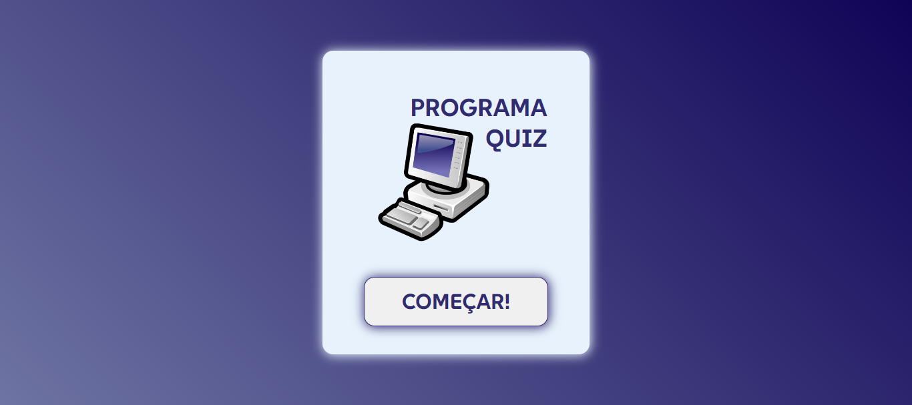

### Screenshot

### Links

- Solution URL: [Repository](https://github.com/aslinsjr/quiz-solo)
- Live Site URL: [Page](https://aslinsjr.github.io/quiz-solo/)

## My process

### Built with

- Semantic HTML5
- CSS custom properties
- Flexbox
- CSS Grid
- JavaScript

### What I learned

I learned how to overcome some challenges with positioning, margins and how to create small button animations using just HTML and CSS.

### Continued development

In the process of continuing to develop my skills, I intend to focus on deepening use of FlexBox and the precision of responsiveness.

## Author

- Linkedln - [Alexandre Lins](https://www.linkedin.com/in/aslinsjr/)
- Frontend Mentor - [@aslinsjr](https://www.frontendmentor.io/profile/aslinsjr)

